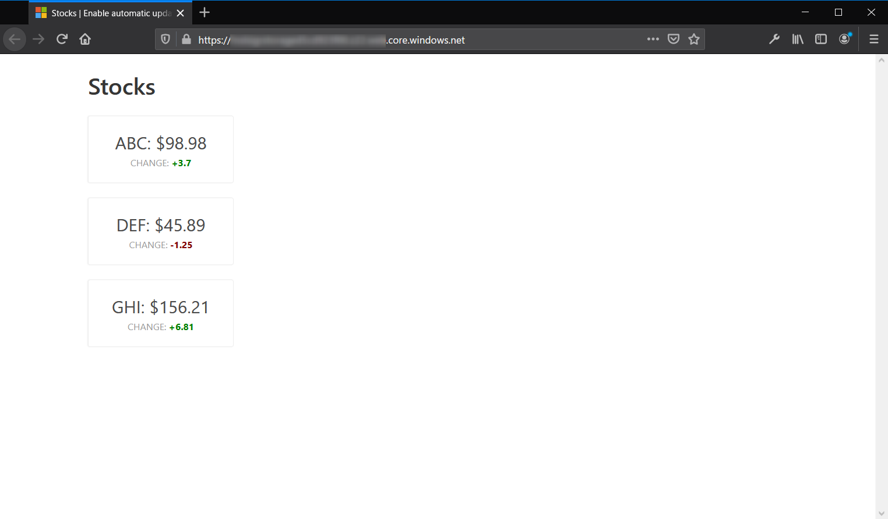
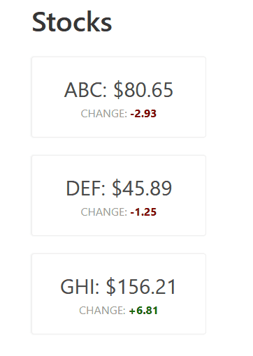
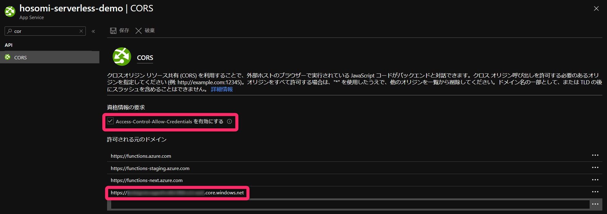

# learn-automatic-update-of-a-webapp-using-azure-functions-and-signalr

https://docs.microsoft.com/ja-jp/learn/modules/automatic-update-of-a-webapp-using-azure-functions-and-signalr/

  

  

## 特記事項

``Access-Control-Allow-Credentials を有効にする`` は忘れがちなので注意が必要。   
これを忘れると初期表示は可能ですが、データが更新された際の画面の更新がエラーでされません。  

